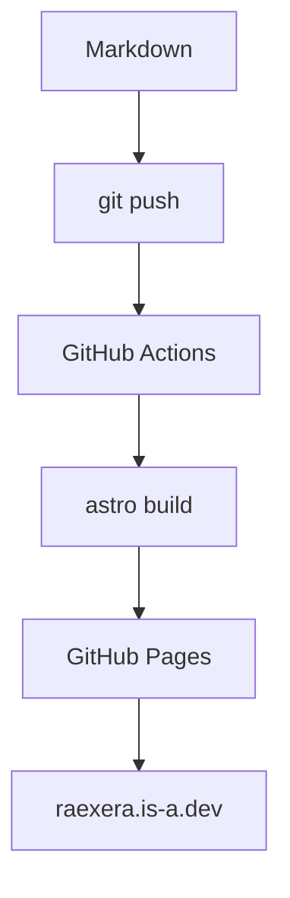
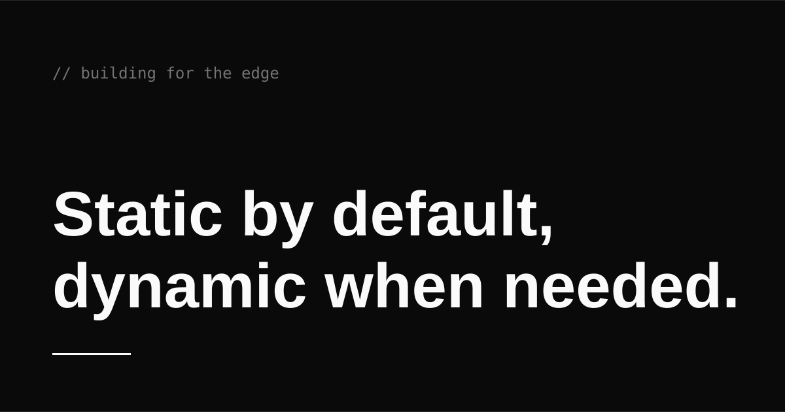

> Every blog has a first post. This is mine, and yes, I'm starting with the oldest cliché in the book.

It's a cliché for a reason. `Hello, World` is the first program most of us ever ran, and this is the first thing I'm publishing here. Consider it a handshake: I'll write, you read, and we'll figure out the rest as we go.

## Who am I?

I'm Rayhan, a **DevSecOps engineer** who spends most days between Terraform, Kubernetes, and whichever CI pipeline is on fire this week.

This blog is my public notebook. Some posts will be _opinionated_, others incomplete, and plenty will be ~~wrong~~ revisited as I learn better. That's deliberate: writing in the open means getting corrected, and that's exactly how I want it.

## What to expect

This blog is deliberately general. No single niche, no editorial calendar; I write about whatever I want to remember, teach, or share.

### The kinds of things I'll write

- **Work**: infrastructure, security, and the systems I operate every day.
  - Terraform, Kubernetes, and CI pipelines
  - The boring engineering that keeps things running
- **Technical**: deep dives into problems I solved the hard way.
- **Tips & tricks**: small things that save an hour here and there.
- **Code**: snippets, tools, and experiments worth keeping.
- **Notes of my life**: hobbies, thoughts, and whatever else is worth remembering.

#### The only rule

If it's worth remembering or sharing, it's worth a post.

## Why write in public?

1. Writing forces clarity. If I can't explain it, I don't understand it.
2. A public trail beats a private wiki when someone asks "where did you see that?"
3. Smarter people might correct me, and that's a feature, not a bug.

## The plan

- [x] Launch the blog
- [x] Set up code highlighting
- [ ] Publish at least once a month
- [ ] Write up my homelab setup

## A taste of the content

Posts will lean on code over prose. The kind of Go I'd write to sort a list of posts:

```go
type Post struct {
	Title     string
	Published time.Time
	Tags      []string
}

func latest(posts []Post) Post {
	sort.Slice(posts, func(i, j int) bool {
		return posts[i].Published.After(posts[j].Published)
	})
	return posts[0]
}
```

The kind of manifest I stare at every day:

```yaml title="deployment.yaml"
apiVersion: apps/v1
kind: Deployment
metadata:
  name: blog
  labels:
    app: blog
spec:
  replicas: 2
  selector:
    matchLabels:
      app: blog
  template:
    metadata:
      labels:
        app: blog
    spec:
      containers:
        - name: blog
          image: raexera/blog:latest
          ports:
            - containerPort: 8080
```

The shell one-liners I actually type:

```bash
kubectl get pods --sort-by=.metadata.creationTimestamp
```

And when I move infrastructure around, the diff usually looks like this:

```diff
  resource "google_container_cluster" "primary" {
    name     = "primary"
-   location = "asia-southeast1"
+   location = "asia-southeast2"
  }
```

## What I write with

A deliberately small stack:

| Tool     | Role                | Why                |
| -------- | ------------------- | ------------------ |
| Astro    | Site framework      | Static by default  |
| Markdown | Content             | Portable, readable |
| Shiki    | Syntax highlighting | Accurate, fast     |

## How a post ships



## What I type on

I have a slight obsession with HHKB-layout keyboards, both MX and Topre. Here's the current daily driver:


Custom switches, keycaps, and the endless hunt for the perfect _clack_, a hobby that never quite feels finished.

## The fine print



This site is built to be fast and quiet: no trackers, no popups, no "subscribe to my newsletter" banner. Just words and code, rendered as plain [HTML](https://en.wikipedia.org/wiki/HTML).

If you want to reach me, email is easiest: [raexera@gmail.com](mailto:raexera@gmail.com)

---

Thanks for reading. The next post is already in the works.
