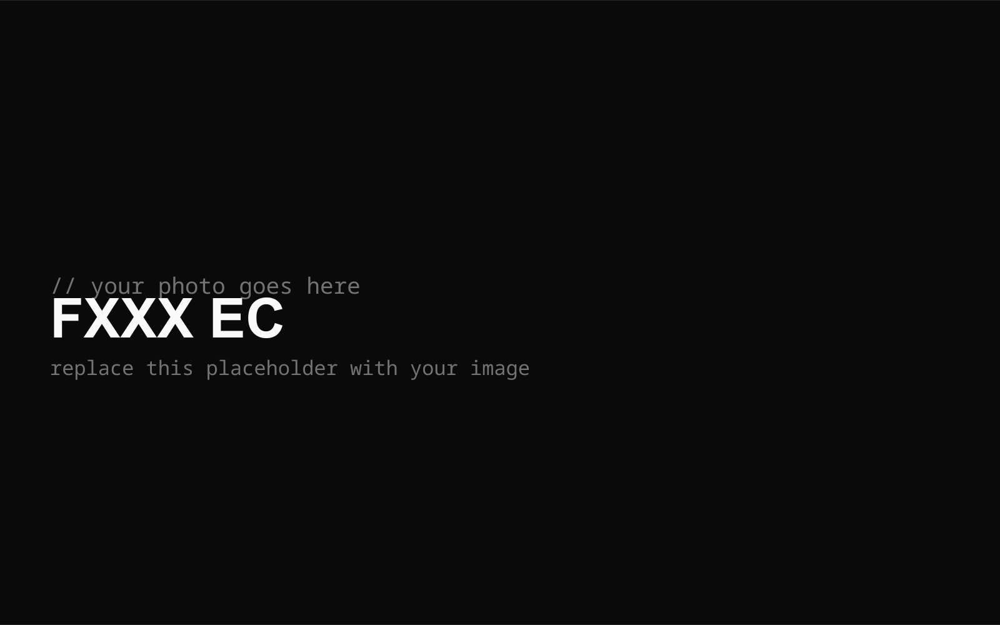

I didn't plan to write about keyboards. But after years of buying, selling, and rebuilding, a self-silenced Topre, and one very weird charity rescue, I think I've finally reached the end. And honestly? It feels great.

This is the story of how I went from chasing "thock" to loving "clack", from hype switches to OG Cherry MX, and from a drawer full of boards to a two-keyboard rotation with three builds I actually believe is my endgame.

## The layout evolution

My journey started in 2022 with a 65% kit. Then I stepped away from keyboards entirely for three whole years. When I came back, I was basically an outsider again, relearning everything from scratch.

I returned in 2025, cycled through a few 75% boards, dropped back to 65%, down to 60%, briefly went back up to 65%, then committed to 60% before a quick 70% detour, and finally landed on the True HHKB layout. The full path:

**65% → 75% → 65% → 60% → 65% → 60% → 70% → True HHKB**

Every step taught me something. The early boards covered the basics. The 75% phase introduced me to full aluminum cases, and the copper-bottomed 65% taught me what real density feels like. Dropping to 60% made me realize I never used arrow keys or a function row anyway. The 70% was fun but short-lived. And the HHKB layout was the final form: everything I need, nothing I don't.

## The board timeline

Here's every board I've owned, in order. Some were stepping stones. A few were mistakes. All of them led somewhere.

| Board                         | Layout    | Notes                                                                                                                              |
| ----------------------------- | --------- | ---------------------------------------------------------------------------------------------------------------------------------- |
| IrisLab Jris65                | 65%       | My first real kit: a budget gasket-mount in full CNC aluminum with a 6-degree angle. It taught me the basics and got me hooked.    |
| ATK V75X                      | 75%       | The comeback. A semi-aluminum gaming 75 with a 1ms chip and tri-mode wireless. Cheap, fast, and perfect for re-entering the hobby. |
| Leobog Hi75                   | 75%       | Entry full aluminum. A powder-coated gasket board with a knob, and the moment the thock chase officially began.                    |
| Womier RD75                   | 75%       | Peak thock. A QMK/VIA aluminum 75 with tool-free disassembly and a stainless steel weight. The turning point.                      |
| QK Neo65 Cu                   | 65%       | The copper upgrade. A QwertyKeys board with a solid copper bottom case and dual mounting. Dense, clean, and heavy.                 |
| QK Neo60 Cu (WK)              | 60%       | My first 60%. The same copper treatment as the Neo65, just smaller. Later traded toward the HHKB layout.                           |
| Tech Bear Studio TB-65F       | 65%       | A mid-tier shuffle. Three microswitch buttons and a ripple-finish weight, but it never really stuck.                               |
| QK Neo65 Core Plus            | 65%       | An aluminum Neo65 with a 3D copper weight. Brighter and lighter, and it confirmed I prefer 60% anyway.                             |
| QK Neo60 Cu (HHKB)            | 60%       | The HHKB Neo60, traded from the WK. Copper bottom, dual mount, and the layout finally felt right.                                  |
| KBDFans Agar                  | 60%       | The transition board. An HHKB-style 60 with a silicone gasket and a curved case. Smooth, but just a stepping stone.                |
| GDKLabs NV70                  | 70%       | A 70% detour inspired by the Hyundai N Vision 74, with a swappable numpad and dual-gasket mount. Cool, but not for me.             |
| PFU HHKB Professional Classic | True HHKB | The real Topre. 45g electrostatic capacitive, which I self-silenced and lubed. This is where I learned what clack actually means.  |
| RME Studio Alas               | 60%       | Endgame mechanical. A gummy O-ring friction-fit 60 with brass weights and a 7-degree angle. Heavy, rare, and worth the wait.       |
| OF Studio FXXX EC             | True HHKB | Endgame electro-capacitive. A custom EC build with RS 45g domes and that buttery, bouncy full-dome collapse.                       |

And here's that whole journey as a diagram, showing the layout changes and the flow between boards. The endgame boards live in their own little domain, they are not sold.

```d2
direction: down
2022 -> 2025: hiatus 2023-2024

2022: {
  Jris65: "IrisLab Jris65"
}

2025: {
  ATK: "ATK V75X"
  Hi75: "Leobog Hi75"
  RD75: "Womier RD75"
  Neo65: "QK Neo65 CU"
  Neo60WK: "QK Neo60 CU (WK)"
}

2026: {
  TB65F: "Tech Bear Studio TB-65F"
  Neo65CP: "QK Neo65 Core Plus"
  Neo60HHKB: "QK Neo60 CU (HHKB)"
  Agar: "KBDFans Agar"
  NV70: "GDKLabs NV70"
  HHKB: "PFU HHKB Professional Classic"
}

Endgame: {
  Alas: "RME Studio Alas"
  FXXX: "OF Studio FXXX EC"
}

2025.ATK -> 2025.Neo65: sold for
2025.Hi75 -> 2025.Neo65: sold for
2025.RD75 -> 2025.Neo65: sold for
2025.Neo65 -> 2025.Neo60WK: sold for
2025.Neo60WK -> 2026.Neo60HHKB: traded for
2026.TB65F -> 2026.Neo65CP: sold for
2026.Neo65CP -> 2026.Agar: sold for
2026.Agar -> 2026.NV70: sold for
2026.NV70 -> 2026.HHKB: sold for
2026.Neo60HHKB -> Endgame.Alas: sold for
2026.HHKB -> Endgame.FXXX: sold for
```

## The switch hype cycle

I joined the hype train early. I waited months for the "next big thing" linear switch, paid a premium, and sold it at a loss the moment the next one dropped. Rinse and repeat.

Then I got tired. The new switches felt identical to the old ones. I was chasing a ghost.

So I went back to the foundation: **OG Cherry MX**. MX2A Blacks for linear, MX2A Browns for tactile. No hype, no waiting, no group buys. Just switches that have been refined for decades and still feel better than most of what's on the market.

## The sound preference shift

I started out wanting **thock**.

I ended up loving **clack**.

The shift happened somewhere between the 75% phase and the copper-bottomed 65%. I wanted sharp, high-pitched, firm, and crisp. Not deep, muted, or foamy. That preference shift is what eventually led me to my endgame configurations.

## The endgame rotation

Endgame isn't one board. It's a set of builds that covers your whole preference spectrum. Mine covers three distinct experiences across two chassis.

### 1. Alas, The Mechanical Keyboard

I run two builds on the same Alas chassis. Same case, same soul.


#### Build 1: The Linear

**Config:** Aluminum plate + O-ring + MX2A Blacks + GMK Verdant Retro.

My reference. The aluminum plate keeps it stiff and direct, the O-ring adds a touch of give, and the MX2A Blacks are crisp and sharp. Clacky, high-pitched, and full, exactly how I want a linear to feel.

#### Build 2: The Tactile

**Config:** ABS plate + O-ring + MX2A Browns + GMK Verdant Retro.

The tactile twin. The ABS plate doesn't mute a thing, and I wouldn't want it to. The MX2A Browns are damn clacky, loud, and high-pitched, just like the Blacks. The only real difference is the crisp tactile bump on every press. Same sharpness, same fullness, same vibe.

#### Why two builds?

Because sometimes I want a bump and sometimes I don't. Both builds are sharp, clacky, and full, with the same high-pitched energy. I hate muted and hollow boards, so neither build leans that way. Build 1 is pure linear, Build 2 adds the tactile bump. I swap between them depending on my mood. Same chassis, two takes on the same sound.

### 2. FXXX EC, The Electro-Capacitive Keyboard

**Config:** OF Studio FXXX EC case + EM60v2 PCB + MetaPulse EC kit + RS 45g domes + PBTFans Lyla.



The EC tactile experience is unmatched. Smooth, buttery, bouncy, full-dome collapse with a "snow-crunch" sound. It's the tactile endgame.

## The 2026 acquisition

The Alas was a 2023 group buy. By 2026, it was long sold out and considered rare.

Then something strange happened. The vendor discovered **3 years of untouched Alas stock** sitting in their warehouse. The original owner had never claimed it.

The vendor and the original owner made a deal: instead of selling it on the aftermarket, they would **charity the board**.

I got it in **BNIB (Brand New In Box), A-Stock condition**. My payment went to charity under three names: the original owner, the vendor, and myself.

It wasn't just a purchase. It was a community rescue from warehouse purgatory. A clean, positive origin story for my endgame board.

## The fine print

This isn't a build log. It's a story about taste, switches, and letting go. I'm grateful for the hobby, the boards, the switches, the late nights, and the friends I made along the way.

If you're still chasing, that's great. I hope you find your endgame too. Just don't forget where you came from.

The endgame is quiet, peaceful, and full of gratitude.

[^1]: "Thock" is that deep, muted, bassy keyboard sound. "Clack" is sharp, high-pitched, and loud. I started wanting thock. I ended up loving clack. With ABS keycaps and Cherry MX switches on a foamless board, you get that crisp, snappy clack every time you type. Pure clacky supremacy.

---

Thanks for reading. The next post is already in the works.
